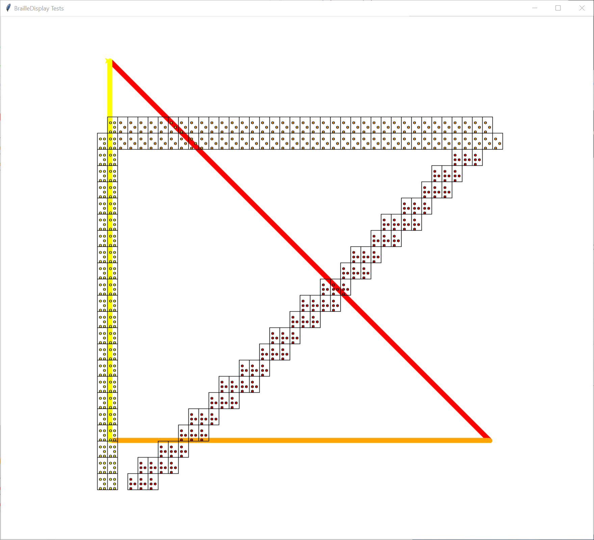
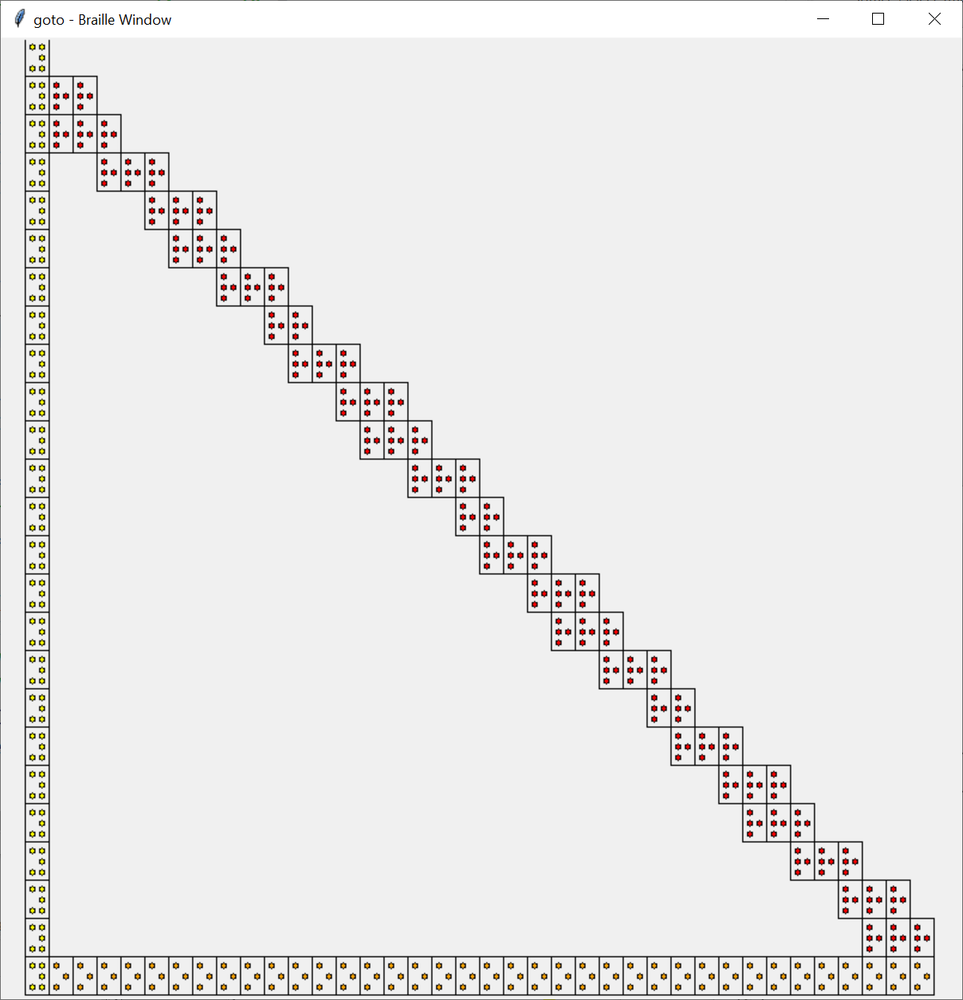

# TurtleBraille
Migrating from resource_lib/turtle_braille/ to Canvas "Scraping" to generate Braille from intercepting each Turtle command and building as set of points to convert.  The rationalle is to avoid an intimite understanding of each Turtle command and its translation into tkinter commands.
# NOTE - in construction
Not functional yet - scaling problems
## Example
## Simple Turtle Display with braille display overlay - erroneous Braille view
The Braille view, overlayed, is scaled incorrectly, especially the vertical view is flipped.

## Simple working braille display
The Braille view, only braille, from working resource_lib code, correctly displayed.


## Problem
Somewhere in the new code we are scaling incorrectly.  Just to get the display to position for viewing I had to hack the Turtle goto function as shown in the code snippet below.  If I could think of a way to make the code smaller I would send it to something like ***stackoverflow*** and pose the question.
### Code Snippet
```
        
class BrailleDisplay:
    """ Create and display graphics using Braille
    """
    def __init__(self, title="Braille Display",
                 canvas=None,
                 win_width=800, win_height=800,
                 point_resolution=None):
        """ Setup display
...     """
        screen = tu.TurtleScreen(canvas)
        self.rtu = tu.RawTurtle(canvas)          # For turtle screen
...
    
    def goto(self, x, y=None):
        x += self.x_max/2 + 10*(self.cell_xs[1]-self.cell_xs[0])  # HACK to position viewing
        y -= (self.y_max/2 + 4*(self.cell_ys[1]-self.cell_ys[0])) # HACK to position viewing
        self.rtu.goto(x,y)
```


